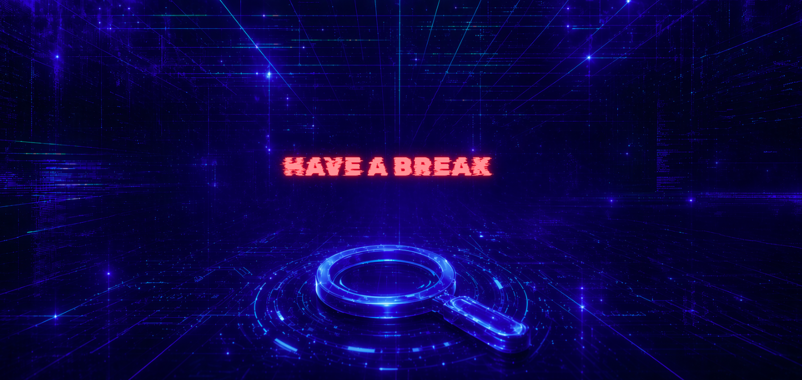

  

<table width="100%" border="1" cellpadding="6" cellspacing="0">
  <tr>
    <td align="left" ><b>🎯 Target</b></td>
    <td>Have a Break</td>
  </tr>
  <tr>
    <td align="left" ><b>👨‍💻 Author</b></td>
    <td><code>sonyahack1</code></td>
  </tr>
  <tr>
    <td align="left" ><b>📅 Date</b></td>
    <td>20.04.2026</td>
  </tr>
  <tr>
    <td align="left" ><b>📊 Difficulty</b></td>
    <td>Medium 🟡</td>
  </tr>
  <tr>
    <td align="left" ><b>📁 Category</b></td>
    <td> OSINT </td>
  </tr>
  <tr>
    <td align="left" ><b>🛠️ Tools</b></td>
    <td>  </td>
  </tr>

</table>

## Investigation Flow

<h2 align="center"> 📝 Report </h2>

test 123
