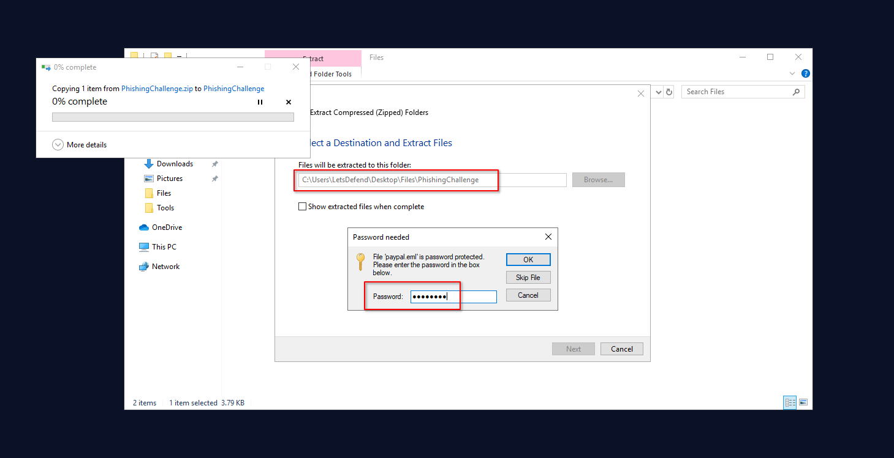
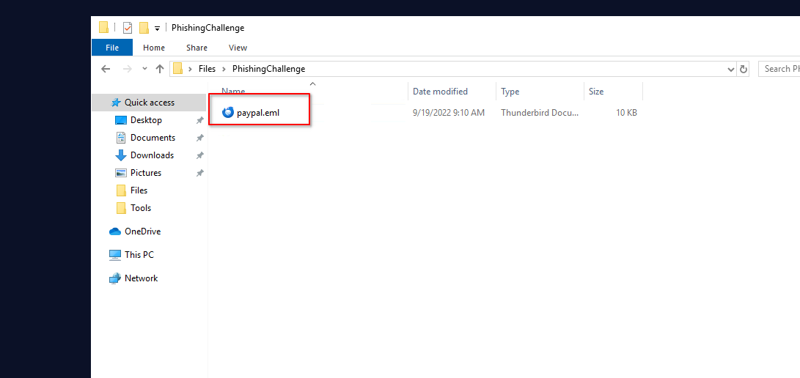
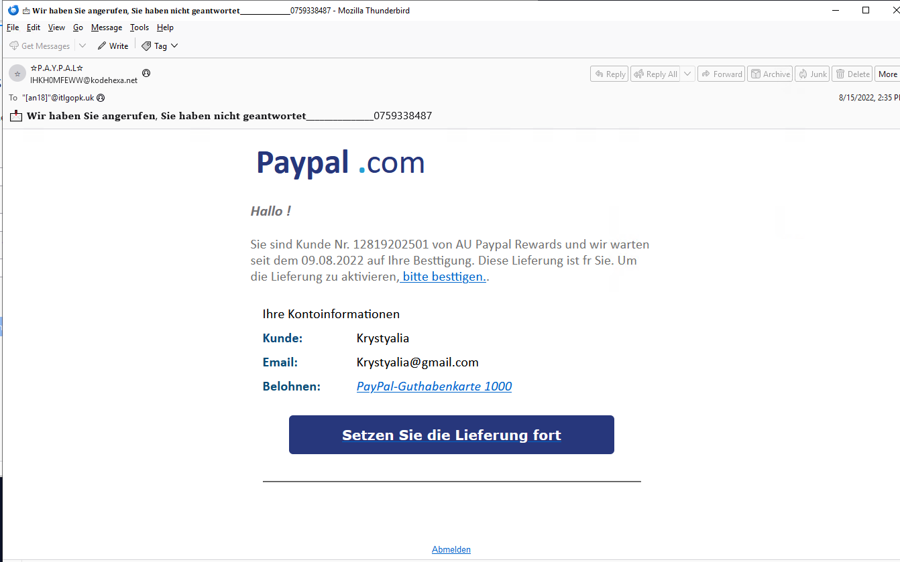
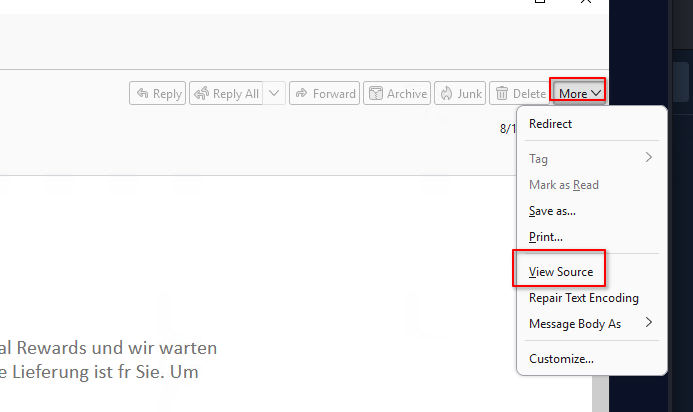
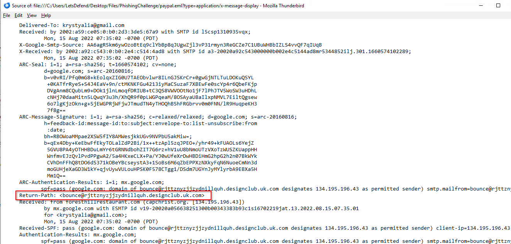
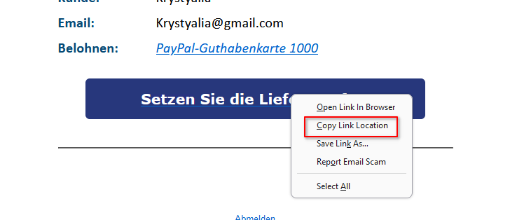
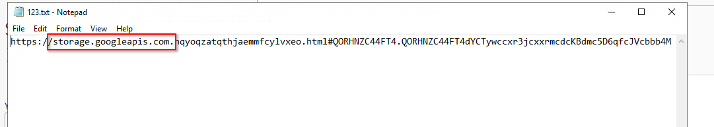
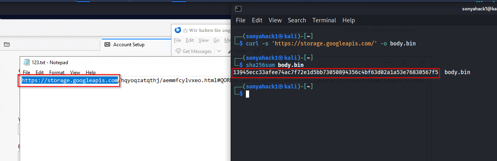
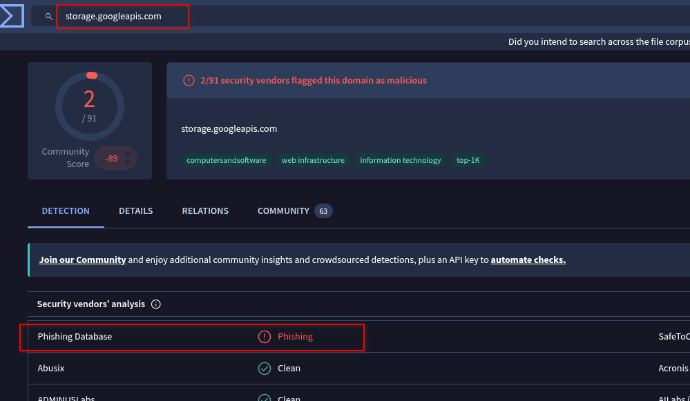
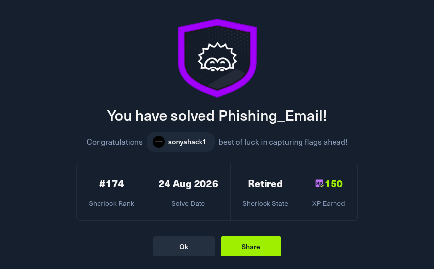

  

<table width="100%" border="1" cellpadding="6" cellspacing="0">
  <tr>
    <td align="left" ><b>🎯 Target</b></td>
    <td>Phishing_Email</td>
  </tr>
  <tr>
    <td align="left" ><b>👨‍💻 Author</b></td>
    <td><code>sonyahack1</code></td>
  </tr>
  <tr>
    <td align="left" ><b>📅 Date</b></td>
    <td>25.08.2026</td>
  </tr>
  <tr>
    <td align="left" ><b>📊 Difficulty</b></td>
    <td>Very Easy 🟢</td>
  </tr>
  <tr>
    <td align="left" ><b>📁 Category</b></td>
    <td> SOC / Phishing Analysis </td>
  </tr>
  <tr>
    <td align="left" ><b>🛠️ Tools</b></td>
    <td> Thunderbird | VirusTotal | curl | sha256sum </td>
  </tr>

</table>

## Sherlock Scenario

Your email address has been leaked and you receive an email from Paypal in German. Try to analyze the suspicious email.

File location: `C:\Users\LetsDefend\Desktop\Files\PhishingChallenge.zip`
Password: `infected`

## MITRE ATT&CK Mapping

| ID | Tactic | Technique | Evidence |
|---|---|---|---|
| T1566.002 | Initial Access | Phishing: Spearphishing Link | The PayPal-themed phishing email contains an embedded link directing the recipient to externally hosted content. |
| T1204.001 | Execution | User Execution: Malicious Link | The embedded button is designed to persuade the recipient to follow the malicious link. Actual user interaction was not confirmed. |

## Indicators of Compromise

| Type | Indicator | Context |
|---|---|---|
| Return-Path | `bounce@rjttznyzjjzydnillquh.designclub.uk.com` | Return-Path identified in the email headers |
| Domain | `storage.googleapis.com` | Cloud-storage domain referenced by the embedded URL |
| URL | `hxxps://storage[.]googleapis[.]com/...` | URL extracted from the email button |
| SHA-256 | `13945ecc33afee74ac7f72e1d5bb73050894356c4bf63d02a1a53e76830567f5` | SHA-256 of the HTTP response body |

## Investigation Flow

- [MITRE ATT CK Mapping](#mitre-att-ck-mapping)
- [Indicators of Compromise](#indicators-of-compromise)
- [Return-Path Analysis](#return-path-analysis)
- [URL and Domain Analysis](#url-and-domain-analysis)
- [HTTP Response Body Hash](#http-response-body-hash)
- [VirusTotal Analysis](#virustotal-analysis)
- [Recommended Mitigations](#recommended-mitigations)

<h2 align="center"> 📝 Report </h2>

Extract the archive containing the malicious email:

  

  

The extracted file contains an email written in German and purporting to originate from PayPal:

  

### Return-Path Analysis

`Question`: `What is the return path of the email?`

Examine the email's raw source code:

  

  

The following `Return-Path` address was identified in the email headers - `bounce@rjttznyzjjzydnillquh.designclub.uk.com`

### URL and Domain Analysis

`Question`: `What is the domain name of the url in this mail?`

Extract the URL associated with the button in the email and save it to a text file for further analysis:

  

  

The extracted URL points to the following domain: `storage.googleapis.com`

`Question`: Is the domain mentioned in the previous question suspicious?

`Answer`: Yes, its use in this context is suspicious. Threat actors may abuse cloud-hosting services to distribute malicious content. A PayPal-themed email directing the recipient to an externally hosted object on this domain is inconsistent with the expected PayPal infrastructure and should be investigated further.

### HTTP Response Body Hash

`Question`: `What is the body SHA-256 of the domain?`

Use `curl` to retrieve the HTTP response body from the identified domain and save it as `body.bin`. Calculate the `SHA-256` hash of the downloaded response body:

  

`Answer`: `13945ecc33afee74ac7f72e1d5bb73050894356c4bf63d02a1a53e76830567f5`

### VirusTotal Analysis

`Question`: `Is this email a phishing email?`

Submit the identified domain to VirusTotal and review its reputation and detection results:

  

VirusTotal shows that `2` out of `91` security vendors flagged the domain, including one detection categorizing it as `phishing`. It can be abused by threat actors to host phishing pages or other malicious content.

Combined with the suspicious PayPal themed email and the embedded external URL, the available evidence indicates that the message is a phishing email.

`Answer`: `Yes`

  

## Recommended Mitigations

The following MITRE ATT&CK mitigations may reduce the likelihood or impact of similar phishing attacks:

| ID | Mitigation | Recommendation |
|---|---|---|
| M1054 | Software Configuration | Implement SPF, DKIM and DMARC validation and configure the email gateway to identify sender spoofing and suspicious external links. |
| M1021 | Restrict Web-Based Content | Block the identified malicious URL and use proxy, DNS and secure web gateway filtering to restrict access to known phishing resources. |
| M1017 | User Training | Train users to recognize brand impersonation, unexpected external links and suspicious destination domains. |