

  

<table width="100%" border="1" cellpadding="6" cellspacing="0">
  <tr>
    <td align="left" ><b>🎯 Target</b></td>
    <td>Disk Analysis & Autopsy</td>
  </tr>
  <tr>
    <td align="left" ><b>👨‍💻 Author</b></td>
    <td><code>sonyahack1</code></td>
  </tr>
  <tr>
    <td align="left" ><b>📅 Date</b></td>
    <td>23.04.2026</td>
  </tr>
  <tr>
    <td align="left" ><b>📊 Difficulty</b></td>
    <td>Medium 🟡</td>
  </tr>
  <tr>
    <td align="left" ><b>📁 Category</b></td>
    <td> DFIR (Disk Forensics) / Windows </td>
  </tr>
  <tr>
    <td align="left" ><b>🛠️ Tools</b></td>
    <td> autopsy 4.18.0 </td>
  </tr>

</table>

## Investigation Flow

- [MD5](#md5)
- [hostname](#hostname)
- [users](#users)
- [network configuration](#network-configuration)
- [bookmarks](#bookmarks)
- [user flags](#user-flags)
- [wallpaper](#wallpaper)
- [hack tools](#hack-tools)
- [YARA](#yara)
- [MS-NRPC](#ms-nrpc)

<h2 align="center"> 📝 Report </h2>

> A forensic analysis of the disk image was performed using `Autopsy 4.18.0`, which is pre-installed on a `Windows Server` virtual machine.

  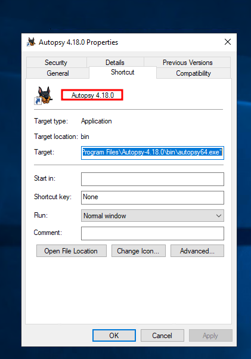

> The disk image `HASAN2.E01` was imported into `Autopsy`:

  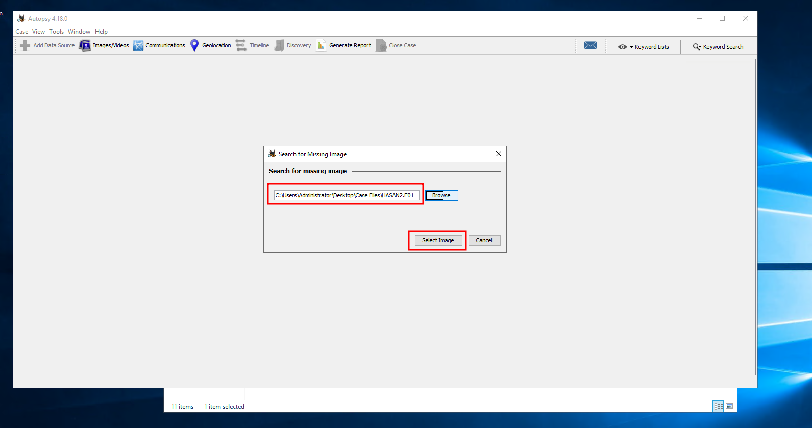

  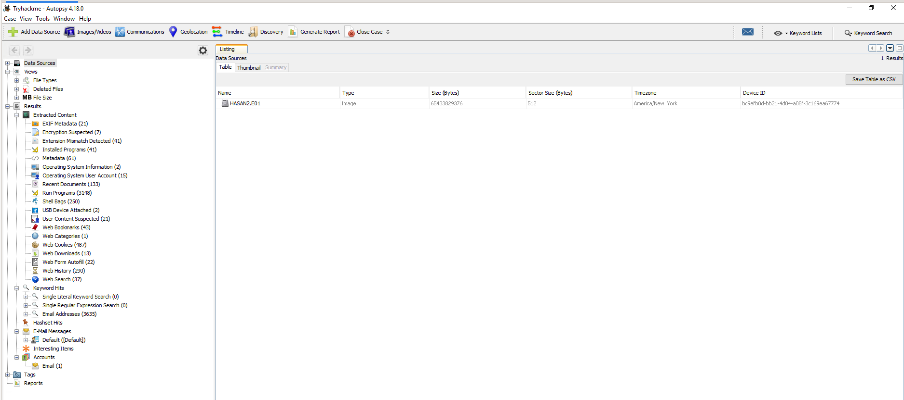

### MD5

> [!IMPORTANT]
> `MD5 (Message Digest Algorithm 5)` - is a cryptographic hash function that produces a `128-bit` fixed-length hash value. It is commonly used to verify file integrity;
> however, it is considered insecure by modern standards.

> The `MD5` hash of the `E01` image can be found in its metadata (`File Metadata`):

  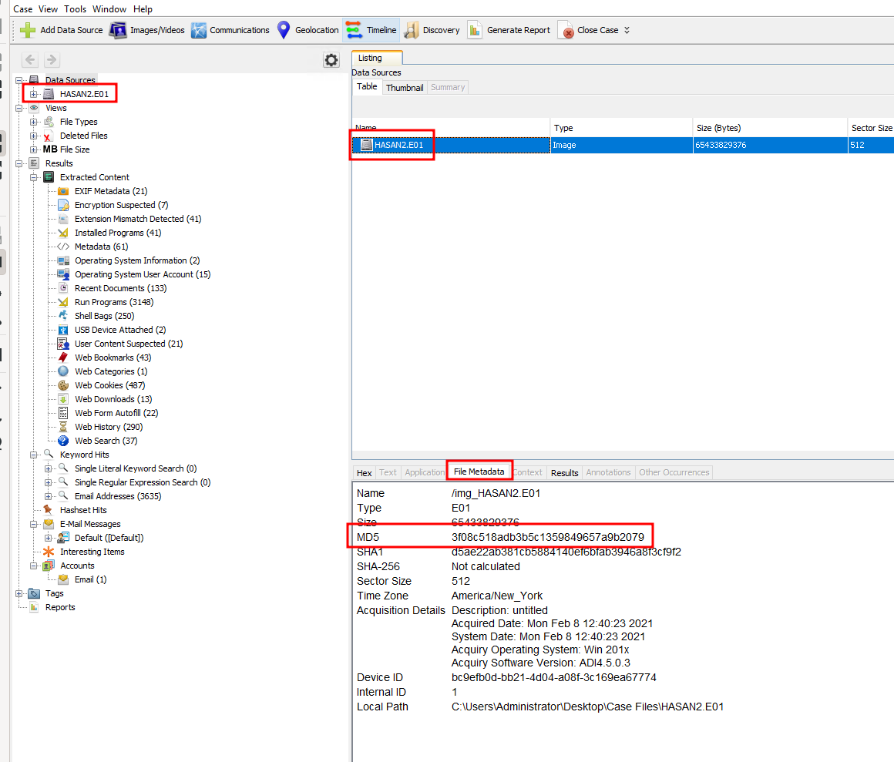

> The `MD5` hash of the image is - `3f08c518adb3b5c1359849657a9b2079`

### hostname

> The system hostname can be identified from the `SYSTEM` file.

>[!IMPORTANT]
> The `SYSTEM` file is a Windows registry hive (`HKLM\SYSTEM`), which is parsed by `Autopsy` as a registry structure. It contains `system configuration data`.
> We will revisit this location multiple times in search of useful artifacts.

> Navigate to `\Windows\System32\Config` and open the `SYSTEM` hive. In the `Application` view, locate the value `Hostname` under the following registry path: `ControlSet001\Services\Tcpip\Parameters`

  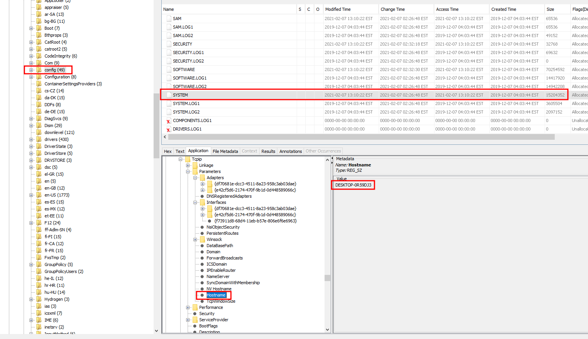

> The system hostname is - `DESKTOP-0R59DJ3`

### users

> Next, user accounts were analyzed.

> Navigate to `Extracted Content` → `Operating System User Accounts` to view all user accounts present on the system.
> We sort the `Username` column alphabetically and focus on the `user accounts`:

  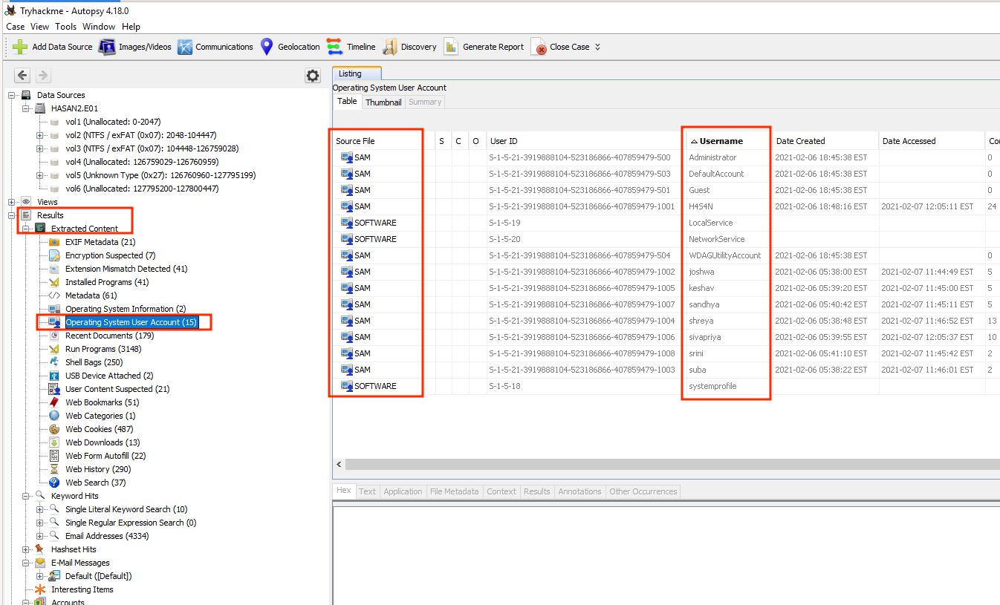

> When sorted alphabetically, the following user accounts are identified - `H4S4N,joshwa,keshav,sandhya,shreya,sivapriya,srini,suba`.

> Next, in the same location, we look at the `Date Accessed` column and see that the most recent system login was performed by the user `sivapriya at 12:05:37 EST`.

  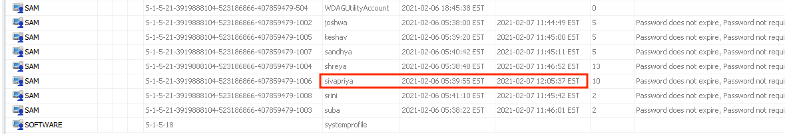

### network configuration

> Next, we examine `network settings`. First, open `Installed Programs` and look for any relevant software:

  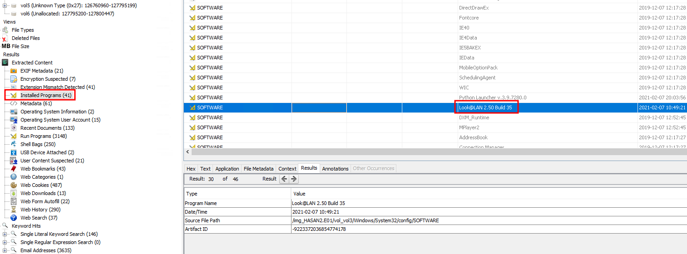

> In the list, we identify the program `Look@LAN 2.50 Build 35`.

>[!IMPORTANT]
> `Look@LAN` - is a relatively old network scanning utility capable of scanning IP ranges and identifying `hosts`, `open ports`, `MAC addresses`, `hostnames`, and more.

> It has a configuration file named `iruni.ini`, which may contain `network settings` of the current host. It is located in `C:\Program Files (x86)\Look@LAN`:

  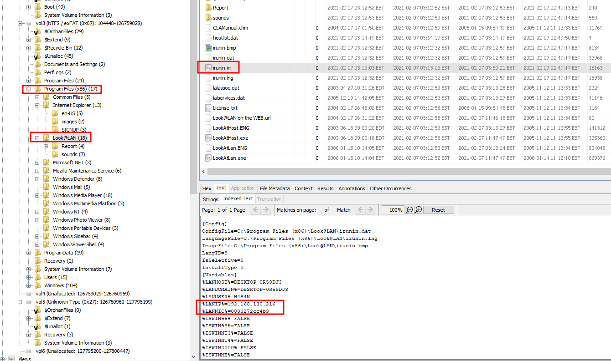

> Inside this configuration file, we find two variables: `%LANIP%` and `%LANNIC%`, which store the hosts IP address (`192.168.130.216`) and MAC address (`08-00-27-2c-c4-b9`).

> Next, we need to determine which `network card` is used. Navigate to the registry key: `ControlSet001\Control\Class{4d36e972-e325-11ce-bfc1-08002be10318}`.
> This location contains keys such as `0000`, `0001`, etc. In key `0001`, we find the `DriverDesc value: Intel(R) PRO/1000 MT Desktop Adapter`:

  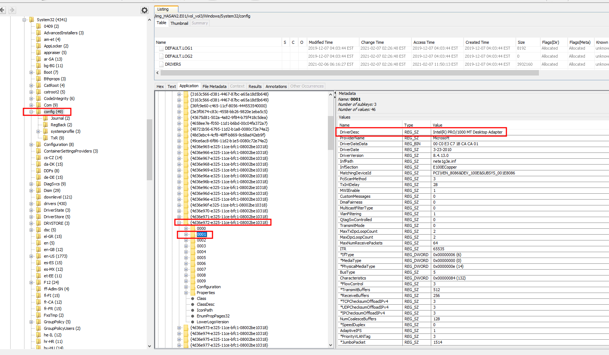

> This is the `network card` used by the system.

### bookmarks

> Next, we examine `browser bookmarks`.

> Navigate to `Web Bookmarks` and search for keywords such as `Google` or `Google Maps`:

  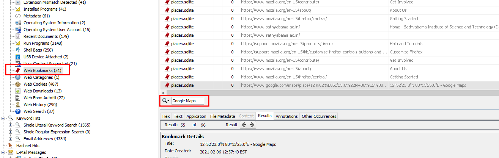

> Locate the relevant bookmark and review its `Title`:

  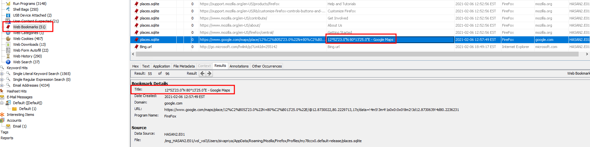

> We identify the location coordinates - `12°52'23.0"N 80°13'25.0"E`

### wallpaper

>[!IMPORTANT]
> `wallpaper` - is a desktop background image, which can differ for each user. It is typically located at: `C:\Users\<user>\AppData\Roaming\Microsoft\Windows\Themes`

> By manually reviewing user directories, we find the following image belonging to user `joshwa`:

  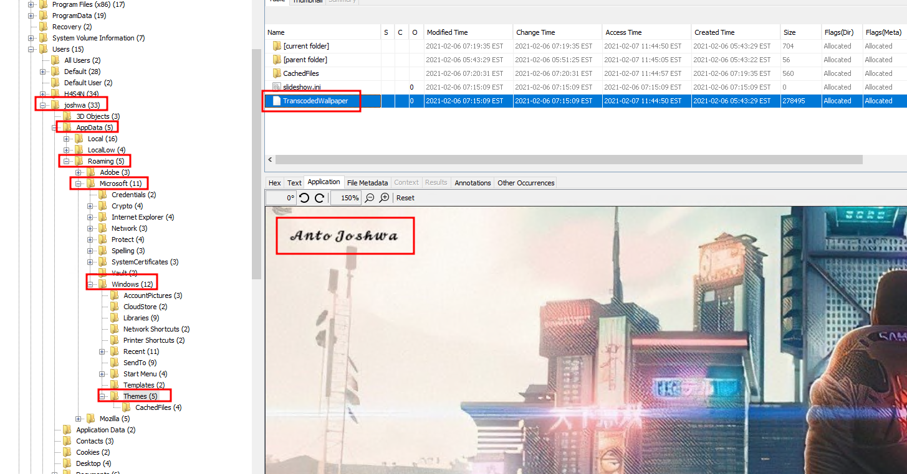

> In the corner of the image, we identify the full name: `Anto Joshwa`

### user flags

> While reviewing user `Desktop` directories, we find a file named `exploit.ps1` belonging to user `shreya`. We proceed to analyze its contents:

  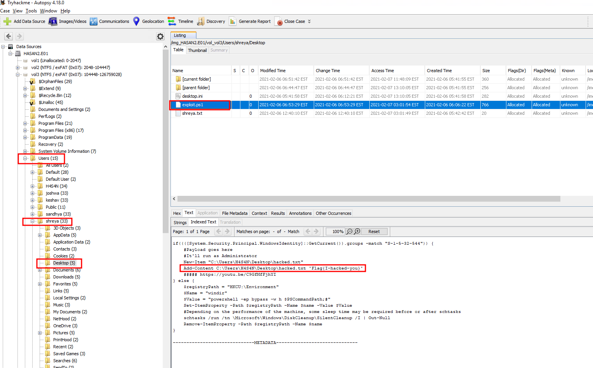

> We find the first flag - `flag{I-hacked-you}`

> However, the file was modified using `PowerShell`. We will examine the `command history` to determine what changes were made.

> The `PowerShell` command history file for the user can be found at: `C:\Users\shreya\AppData\Microsoft\Windows\PowerShell\PSReadLine`. Open the file `ConsoleHost_history.txt`:

  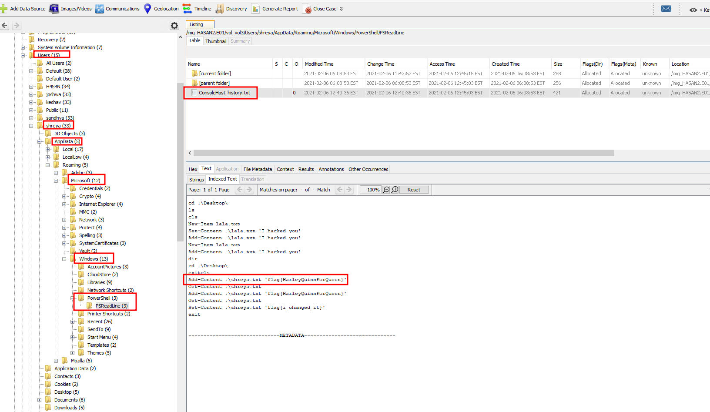

> We find the second flag - `flag{HarleyQuinnForQueen}`

### hack tools

> Next, we identify `hacking tools` that were downloaded onto the system.

> Navigate to the `Run Programs` section and sort by the `Program Name` column to easily identify non-standard installations while filtering out built-in system tools.
> In the list, we identify two tools: `lazagne` and `mimikatz`.

  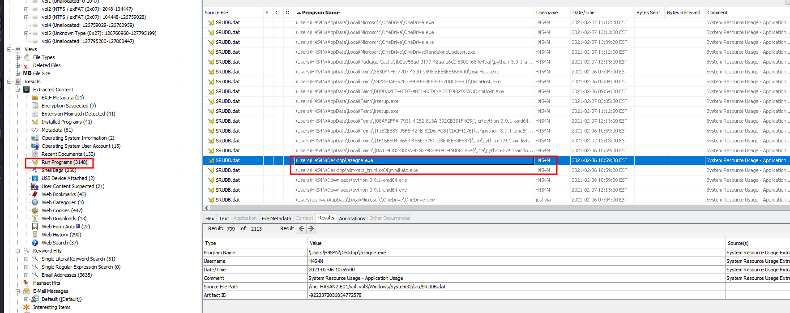

>[!IMPORTANT]
> `lazagne` - is a tool designed to extract passwords stored on a local machine.

>[!IMPORTANT]
> `mimikatz` - is an open-source tool that allows users to view and extract authentication credentials such as `Kerberos tickets`. Like `lazagne`, it is used to retrieve user authentication data.

### YARA

>[!IMPORTANT]
> `YARA` files are text files containing `rules` used to identify, classify, and detect malware (such as `viruses`, `trojans`, and `ransomware`) as well as other suspicious files.
> In simple terms, they are rule sets for malware detection and typically use the `.yar` extension.

> Navigate to `Recent Documents` and search for `.yar` to locate the following shortcut:

  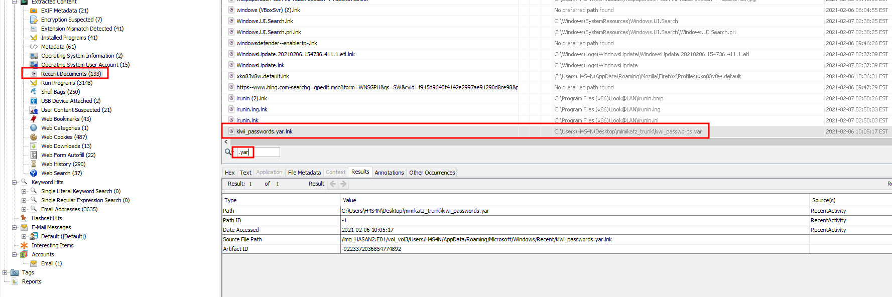

> The shortcut points to the file location. Additionally, we find an archive named `mimikatz_trunk` in the Downloads folder, which can be extracted to the desktop:

  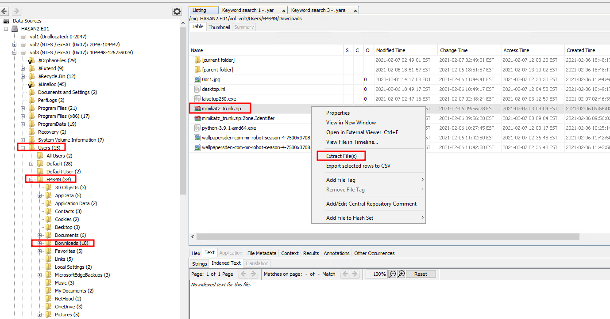

> Among the extracted files, we locate `kiwi_passwords.yar`. Open it in a text editor to check the `author`:

  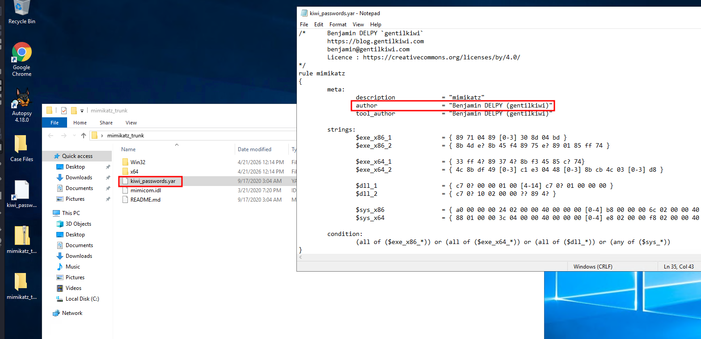

> The author of this `mimikatz` detection rule is - `Benjamin DELPY (gentilkiwi)`.

### MS-NRPC

> One of the users attempted to exploit the `MS-NRPC` vulnerability to bypass authentication on the domain controller. We need to locate the corresponding archive.

>[!IMPORTANT]
> `MS-NRPC`, also known as `Zerologon` - is a vulnerability in the encryption protocol used by the `Netlogon` service. This protocol allows computers to authenticate with
> a domain controller and update their passwords in `Active Directory`. Exploiting this vulnerability can grant an attacker the highest privileges on the domain controller,
> effectively `compromising the entire corporate network`.

> Navigate to `Recent Documents` and search for keywords such as `zero` or `zerologon`.

  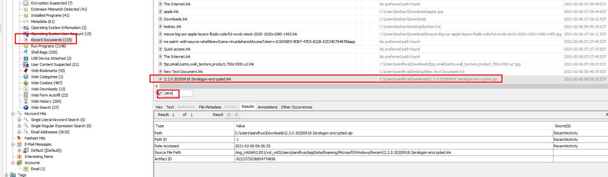

> We discover an archive named `2.2.0 20200918 Zerologon encrypted.zip` located in the Downloads directory of user `sandhya`.

> Investigation completed

